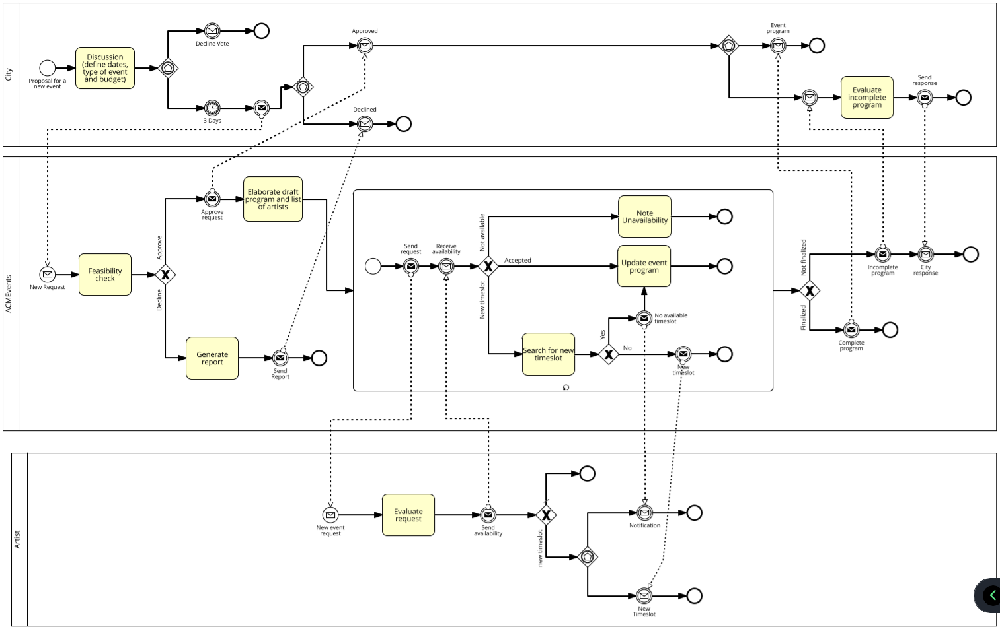
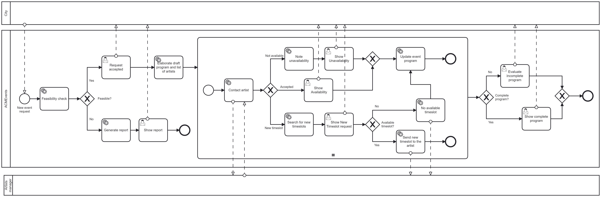
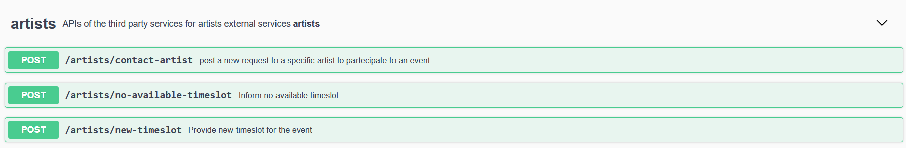

# ACMEvents
The process starts when the CITY, with a council assembly after which none of the member has voted against within 3 days, decides to host a new event. Thus, the CITY contacts the ACMEvents informing about the dates, the type of event (e.g., concert, opera, comedians), and the budget. 

After an internal check the ACMEvents can decide to accept the task or to decline (accept the event if budget > 10000). When declining the ACMEvents sends a report in which the company lists the critical aspects. This report will be considered by the CITY when a new assembly is organized to discuss the event again.

When accepting the ACMEvents elaborate a draft of the overall program and a list of potential artists to call (contact) based on the set of contacts that the company owns. Then, each of them is contacted asking for the availability for the assigned timeslot in the drafted program. 

The artist can accept, decline or ask for a timeslot change. In the first case, the artist will be included in the program, in the second case not and the ACMEvents has to find a new name to be contacted. Finally, in the latter case, the ACME company could find a new timeslot. 

If so, the artist will be informed, and it must accept. If not so, the artist will be informed and let it free while the ACMEvents has to find a new name. 

When all the timeslots are covered by an artist, the ACMEvents send the final program to the CITY. It might happen that the list of artist runs out without covering all the program. In such a case, the ACMEvents sends the incomplete program to the CITY which could approve or reject it, also informing the company about the decision.

## Orchestration diagram


## Executable processes
In this exercise a modified version of the "ACMEvents-BPMN" process has been created to be executable with Camunda engine. 


### Camunda executable process


## External services
Artists services are defined using Swagger.


## Camunda execution
Install docker and run the Camunda image into a docker container.

In the executable_processes directory you can find the two Camunda BPMN diagrams that can be deployed using Camunda modeler.

Two NodeJS based clients are present in the project. They both use the ```node-rest-client``` package to call external services and the ```camunda-external-task-client-js``` package to subscribe to the external tasks in Camunda processes:

- camunda_client is the client for all the external tasks in the "ACMEvent" process

Run both clients with the following commands:
```
npm install
npm start
```

## REST services execution
Run the external services with the following commands:
```
npm install
npm start
```

In http://localhost:3000/docs/ you can find the autogenerated documentation for APIs.