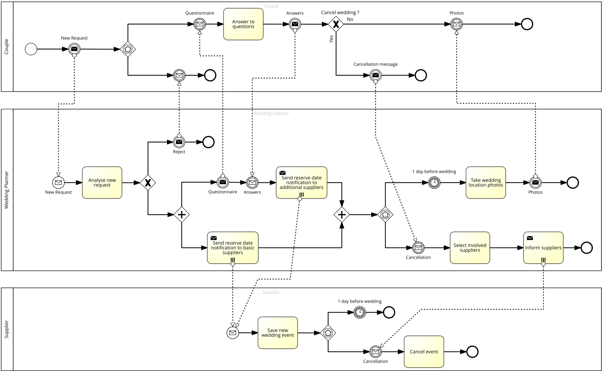
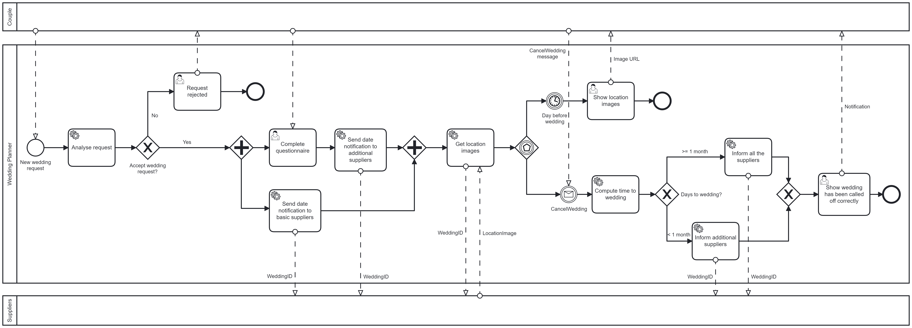

# Wedding Planner
When a wedding planner is contacted by the couple for organizing the event, s/he informed about the desired date and the type of wedding (e.g., romantic, minimal).
The wedding planner, after discussing with her/his collaborator can decide the accept or reject the offering.

In the latter case the process ends. 
 
In the former case, the wedding planner sends a questionnaire to the couple and while s/he is waiting for the answers, an initial set of basic suppliers (e.g., restaurants, location providers) are contacted informing about the need to reserve the date. 
 
Once the feedback from the couple has been received, based on the answers, an additional set of suppliers will be informed about the wedding date. The day before the wedding, the couple will receive by the wedding planner a set of photos and videos related to the location that has been prepared for the event. 
 
It might also happen that the couple decides to cancel the wedding. If this happens more than a month in advance w.r.t. the wedding date, the wedding planner will send a message to all the suppliers to cancel the work. Otherwise, the wedding planner will inform only the additional suppliers.

## Collaboration diagram


## Executable processes
In this exercise a modified version of the "Wedding Planner" process has been created to be executable with Camunda engine. 

In order to maintain consistency with the collaboration diagram, a very simple process for the interaction with messages, when a wedding request is canceled, has been developed using camunda API for correlate asynch messaging. Check [here](https://docs.camunda.org/manual/7.18/reference/rest/process-instance/post-correlate-message-async/) for more information.

### Main process


### Cancel wedding process


## External services
Both basic and additional suppliers services are defined using Swagger.


## Camunda execution
Install docker and run the Camunda image into a docker container.

In the executable_processes directory you can find the two Camunda BPMN diagrams that can be deployed using Camunda modeler.

Two NodeJS based clients are present in the project. They both use the ```node-rest-client``` package to call external services and the ```camunda-external-task-client-js``` package to subscribe to the external tasks in Camunda processes:

- camunda_client is the client for all the external tasks in the "Wedding Planner" process
- message_sender is the client for the external task that allow to send the cancellation message

Run both clients with the following commands:
```
npm install
npm start
```

## REST services execution
Run the external services with the following commands:
```
npm install
npm start
```

In http://localhost:3000/docs/ you can find the autogenerated documentation for APIs.